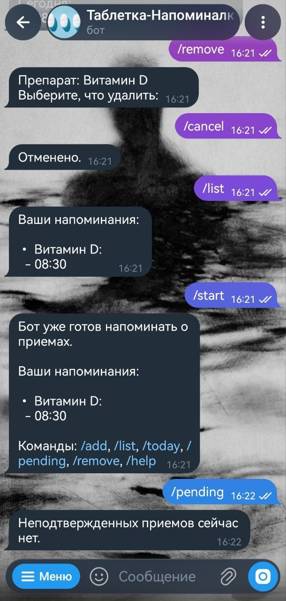

# Tabletka Reminder Bot

A Telegram bot for personal medication reminders.

The bot lets a user add one or more medications with intake times, stores the schedule in a local SQLite database, sends reminders at the specified time, and asks for confirmation with an inline button. If the reminder is not acknowledged, the bot sends repeated follow-up messages every 30 minutes by default until the user confirms the intake.

This is a pet project originally made for everyday use.

## Commands
- /start — start the bot, show the current state, or add the first medication
- /add — add another medication or another time
- /list — show the current reminder list
- /today — show today's medication schedule
- /pending — show unconfirmed intakes
- /remove — delete one time or the whole medication
- /help — show help
- /cancel — cancel the current action

## Tech stack
- Python
- python-telegram-bot
- SQLite
- python-dotenv
- pytz
